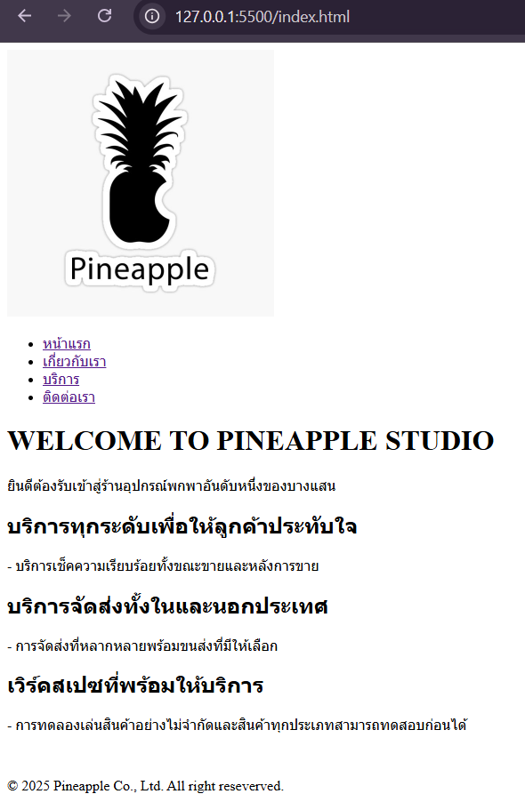
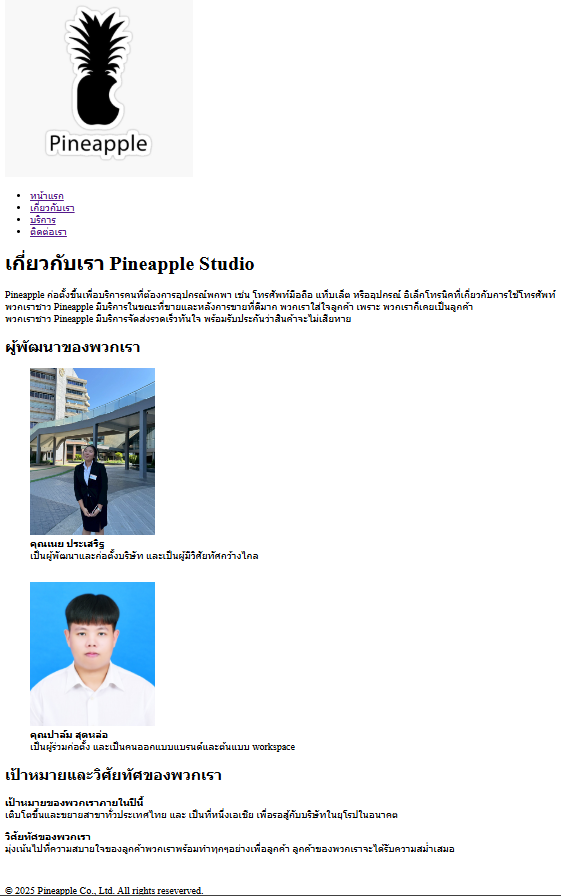
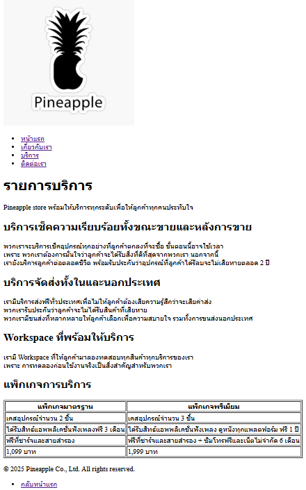
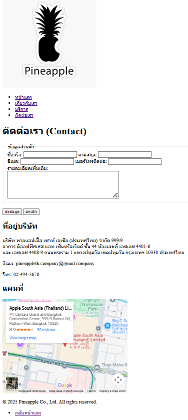

# Pineappple-studio – เว็บไซต์ขายอุปกรณ์อิเล็กโทรนิค

เว็บไซต์จำลองของ **Pineapple-studio** สำหรับ **Assignment #1**  
เป็นเว็บไซต์ขายอุปกรณ์อิเล็กโทรนิค โทรศัพท์ แท็บเล็ต หูฟังไร้สาย และอื่นๆพร้อมการบริการเพื่อลูกค้า

## รายละเอียดข้อมูล

เว็บไซต์ประกอบด้วย **4 หน้าหลัก** ดังนี้ :

1. หน้าแรก (Home)
2. เกี่ยวกับเรา (About)
3. บริการ (Services)
4. ติดต่อเรา (Contact)

## โครงสร้างไฟล์

- index.html : หน้าแรก (Home)
- about.html : หน้าเกี่ยวกับเรา (About)
- services.html : หน้าบริการ (Services)
- contact.html : หน้าติดต่อเรา (Contact)
- images/ : โฟลเดอร์เก็บรูปภาพ
  - pineapple (1).png
  - noey.jpg
  - Sceenshot 2025-12-04 134718.png
  - index.html.png
  - about.html.png
  - Service.html.png
  - contact.html.png
  - README.md : เอกสารประกอบโปรเจกต์

## ลิงก์เข้าสู่หน้าต่างๆ

### [หน้าแรก](index.html)

### [เกี่ยวกับเรา (About)](about.html)

### [บริการของเรา (Services)](services.html)

### [ติดต่อเรา (Contact)](contact.html)

## ผู้จัดทำ

ชื่อ-นามสกุล: นัฐวุฒิ ฟักทิม
รหัสนิสิต: 67610189